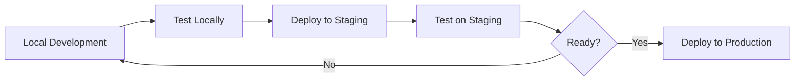

# Deployment Guide

This document explains how to deploy the Mundwerk Health application to Cloudflare Workers.

## Environment Configuration

The application uses environment-specific configuration defined in `wrangler.jsonc`:

### Staging Environment

- **URL:** `staging.mundwerk.health`
- **Feature Flags:**
  - `NEXT_PUBLIC_ENABLE_NAVBAR`: `true` (navbar enabled)

### Production Environment

- **URL:** `mundwerk.health`
- **Feature Flags:**
  - `NEXT_PUBLIC_ENABLE_NAVBAR`: `false` (navbar disabled)

## Deployment Commands

### Deploy to Staging

```bash
pnpm run deploy:staging
```

This will:

1. Build the application with OpenNext for Cloudflare
2. Deploy to the staging environment
3. Make it available at `staging.mundwerk.health`
4. **Enable the navbar** (feature flag set to `true`)

### Deploy to Production

```bash
pnpm run deploy:production
```

This will:

1. Build the application with OpenNext for Cloudflare
2. Deploy to the production environment
3. Make it available at `mundwerk.health`
4. **Disable the navbar** (feature flag set to `false`, shows "Under Construction")

## Local Preview

To test the production build locally before deploying:

```bash
pnpm run preview
```

This builds the application and runs it locally using Cloudflare's Wrangler, simulating the production environment.

## Modifying Environment Variables

### Via wrangler.jsonc (Recommended)

Edit `wrangler.jsonc` to change environment variables:

```jsonc
{
  "env": {
    "staging": {
      "vars": {
        "NEXT_PUBLIC_ENABLE_NAVBAR": "true"  // Modify as needed
      },
      "routes": [...]
    },
    "production": {
      "vars": {
        "NEXT_PUBLIC_ENABLE_NAVBAR": "false"  // Modify as needed
      },
      "routes": [...]
    }
  }
}
```

After modifying, redeploy:

```bash
pnpm run deploy:staging    # For staging changes
pnpm run deploy:production # For production changes
```

### Via Cloudflare Dashboard

Alternatively, set environment variables through the Cloudflare dashboard:

1. Log in to Cloudflare Dashboard
2. Go to **Workers & Pages**
3. Select your **mundwerk-health** project
4. Go to **Settings → Variables**
5. Add or modify environment variables:
   - Variable name: `NEXT_PUBLIC_ENABLE_NAVBAR`
   - Value: `true` or `false`
6. Choose the environment (staging or production)
7. Save and redeploy

## Deployment Workflow

### Typical Development Workflow



### Step-by-Step

1. **Develop locally:**

   ```bash
   pnpm dev
   ```

   - Edit `.env.local` to test feature flags
   - Test both enabled and disabled states

2. **Test production build locally:**

   ```bash
   pnpm run preview
   ```

   - Verify everything works as expected

3. **Deploy to staging:**

   ```bash
   pnpm run deploy:staging
   ```

   - Visit `staging.mundwerk.health`
   - Test on real devices and browsers
   - Verify feature flags work correctly

4. **Deploy to production (when ready):**
   ```bash
   pnpm run deploy:production
   ```

   - Visit `mundwerk.health`
   - Monitor for issues

## Feature Flag Strategy

### Current Strategy

- **Staging:** Test new features (navbar enabled)
- **Production:** Stable version (navbar disabled until ready)

### When to Enable in Production

Enable the navbar in production when:

- ✅ All navigation pages are created
- ✅ Tested thoroughly on staging
- ✅ Mobile and desktop views verified
- ✅ Dark mode tested
- ✅ Accessibility verified
- ✅ Performance is acceptable

To enable in production:

1. Edit `wrangler.jsonc`:

   ```jsonc
   "production": {
     "vars": {
       "NEXT_PUBLIC_ENABLE_NAVBAR": "true"
     }
   }
   ```

2. Deploy:
   ```bash
   pnpm run deploy:production
   ```

## Troubleshooting

### Environment Variable Not Updating

**Problem:** Changed `wrangler.jsonc` but the variable hasn't updated in deployed app.

**Solution:**

1. Make sure you saved `wrangler.jsonc`
2. Redeploy the application:
   ```bash
   pnpm run deploy:staging
   # or
   pnpm run deploy:production
   ```

### Build Fails

**Problem:** Deployment fails during build.

**Solution:**

1. Test the build locally:
   ```bash
   pnpm run build
   ```
2. Check for TypeScript errors:
   ```bash
   pnpm run check
   ```
3. Check for linting errors:
   ```bash
   pnpm run lint
   ```

### Wrong Environment Deployed

**Problem:** Deployed to wrong environment.

**Solution:** Cloudflare doesn't support rollbacks directly. You need to:

1. Fix the configuration
2. Redeploy to the correct environment
3. Or use version control to revert and redeploy

### Custom Domain Not Working

**Problem:** Custom domain returns 404 or connection error.

**Solution:**

1. Verify DNS is configured in Cloudflare
2. Check that routes are correct in `wrangler.jsonc`
3. Wait a few minutes for DNS propagation
4. Check Cloudflare dashboard for any errors

## Monitoring

### Check Deployment Status

```bash
# List all deployments
wrangler deployments list --name mundwerk-health

# View specific environment
wrangler deployments list --name mundwerk-health --env staging
wrangler deployments list --name mundwerk-health --env production
```

### View Logs

```bash
# Tail logs for staging
wrangler tail --env staging

# Tail logs for production
wrangler tail --env production
```

### Check Current Configuration

```bash
# View staging configuration
wrangler whoami --env staging

# View production configuration
wrangler whoami --env production
```

## Rollback Strategy

Since Cloudflare Workers doesn't have built-in rollback:

1. **Use Git Tags:**

   ```bash
   # Tag before deploying
   git tag v1.0.0
   git push origin v1.0.0

   # To rollback, checkout the tag
   git checkout v1.0.0
   pnpm run deploy:production
   ```

2. **Use Feature Flags:**
   - Quick rollback by toggling feature flags
   - No code deployment needed
   - Example: Disable navbar if issues found

3. **Keep Previous Version:**
   - Before deploying, note the current deployment ID
   - Keep the previous code in a branch

## CI/CD Integration

For automated deployments via GitHub Actions, the workflows are already set up in `.github/workflows/`:

- `ci.cd.yml` - Full CI/CD pipeline
- `ci.only.yaml` - CI only (no deployment)

Environment variables for CI/CD should be set as GitHub Secrets:

- `CLOUDFLARE_API_TOKEN`
- `CLOUDFLARE_ACCOUNT_ID`

## Security Considerations

- ✅ Environment variables with `NEXT_PUBLIC_` prefix are safe to expose (client-side)
- ❌ Never put secrets or API keys in `NEXT_PUBLIC_` variables
- ✅ Use Wrangler secrets for sensitive values:
  ```bash
  wrangler secret put SECRET_NAME --env production
  ```

## Resources

- [Cloudflare Workers Docs](https://developers.cloudflare.com/workers/)
- [Wrangler CLI Docs](https://developers.cloudflare.com/workers/wrangler/)
- [OpenNext Cloudflare](https://opennext.js.org/cloudflare)
- [Next.js Deployment](https://nextjs.org/docs/deployment)

---

**Questions?** Check the main README.md or docs/FEATURE_FLAGS.md for more information.
